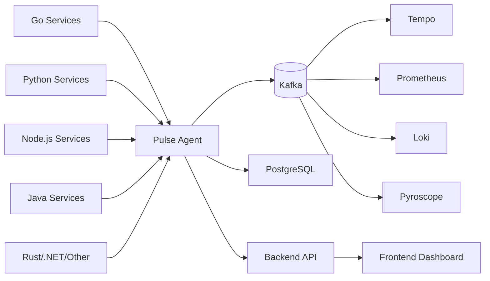

# PulseBoard

<div align="center">
  
  
  
  
  
  
</div>

<div align="center">
  <h1 style="font-size: 3rem; background: linear-gradient(135deg, #667eea 0%, #764ba2 100%); -webkit-background-clip: text; -webkit-text-fill-color: transparent; background-clip: text;">
    PulseBoard
  </h1>
  <p style="font-size: 1.25rem; color: #666; margin-top: 1rem;">
    <strong>Unified Observability Platform</strong> — Collect, process, and route telemetry from any language runtime.
  </p>
</div>

---

## 🎯 What is PulseBoard?

PulseBoard is a **unified observability platform** that collects, normalizes, and routes telemetry data (traces, metrics, logs, profiles) from applications written in **any language** — Go, Python, Node.js, Java, Rust, .NET, and more — into your preferred observability stack (Tempo, Prometheus, Loki, Pyroscope, etc.) via Apache Kafka.



---

## ✨ Key Features

| Feature | Description |
|---------|-------------|
| **🌐 Multi-Language Support** | Auto-instrumentation via OpenTelemetry SDKs for Go, Python, Node.js, Java, Rust, .NET, Rust |
| **📡 Unified Ingestion** | Single agent accepts OTLP (traces, metrics, logs, profiles), Prometheus remote-write, custom logs |
| **⚡ High Performance** | Erlang/OTP agent handles 100k+ spans/sec with sub-millisecond latency |
| **🔄 Kafka-Native** | Durable, replayable event streaming with exactly-once semantics |
| **🎯 Normalization** | Converts OTLP, Prometheus, custom formats → unified internal schema |
| **🔍 Service Discovery** | Auto-discovers targets via Consul, Kubernetes, DNS, static config |
| **📊 Rich Dashboard** | Next.js 16 + React 19 + TanStack Query for real-time observability |
| **🛡️ Production Ready** | mTLS, circuit breakers, backpressure, dead-letter queues, dead-man switches |

---

## 🏗️ Architecture

```
┌─────────────────────────────────────────────────────────────────────────────┐
│                            PULSEBOARD ECOSYSTEM                             │
├─────────────────────────────────────────────────────────────────────────────┤
│                                                                             │
│  ┌──────────────┐     ┌──────────────┐     ┌──────────────────────────┐   │
│  │   AGENTS     │────▶│  PULSE AGENT │────▶│      KAFKA CLUSTER       │   │
│  │  (Go/Py/Node)│     │  (Erlang/OTP)│     │  topics: traces,metrics, │   │
│  └──────────────┘     │   :8082/:8083│     │  logs, profiles          │   │
│                       └──────┬───────┘     └───────────┬──────────────┘   │
│                              │                         │                  │
│                              ▼                         ▼                  │
│                       ┌──────────────┐     ┌──────────────────────────┐   │
│                       │   POSTGRES   │     │   DOWNSTREAM CONSUMERS   │   │
│                       │  (metadata)  │     │  - Tempo (traces)        │   │
│                       └──────────────┘     │  - Prometheus (metrics)  │   │
│                                            │  - Loki (logs)           │   │
│                                            │  - Pyroscope (profiles)  │   │
│                                            └──────────────────────────┘   │
│                                                                             │
│  ┌──────────────┐     ┌──────────────┐     ┌──────────────────────────┐   │
│  │   USERS      │────▶│  FRONTEND    │────▶│      BACKEND API         │   │
│  │  (Browser)   │     │  (Next.js)   │     │  (Go/Chi) :8080          │   │
│  └──────────────┘     │   :3000      │     └───────────┬──────────────┘   │
│                       └──────────────┘                 │                  │
│                                                        ▼                  │
│                                               ┌──────────────────────────┐   │
│                                               │   POSTGRES (primary)     │   │
│                                               │   + Migrations           │   │
│                                               └──────────────────────────┘   │
└─────────────────────────────────────────────────────────────────────────────┘
```

### Component Details

| Component | Technology | Port | Responsibility |
|-----------|------------|------|----------------|
| **Backend API** | Go 1.26 + Chi | 8080 | REST API, auth, migrations, service registry |
| **Frontend** | Next.js 16 + React 19 | 3000 | Real-time dashboard, trace explorer, metrics graphs |
| **Pulse Agent v1** | Erlang/OTP 26 | 8082/8083 | OTLP ingestion, Kafka producer, service discovery |
| **Kafka** | Apache Kafka 3.6+ | 9092 | Durable event streaming backbone |
| **PostgreSQL** | 15+ | 5432 | Primary data store, metadata, migrations |
| **Redis** | 7+ | 6379 | Caching, session store, rate limiting |

---

## 🚀 Quick Start

### Prerequisites
- **Go 1.26.3+**, **Erlang/OTP 24+**, **Node.js 20+**, **Docker 24+**
- **PostgreSQL 15+**, **Kafka 3.6+**, **Redis 7+**

### One-Command Development Start

```bash
# Clone and enter
git clone https://github.com/gaurav/pulseboard.git
cd pulseboard

# Start everything (Postgres, Redis, Kafka, API, Frontend, Agent)
make dev-up

# Or start individually:
make services-up      # Postgres, Redis, Kafka
make migrate-up       # Run DB migrations
make run-server       # Go API on :8080
make run-frontend     # Next.js on :3000
make run-agent        # Erlang agent on :8082/:8083
```

### Verify Installation

```bash
# Health checks
curl http://localhost:8080/health   # Backend API
curl http://localhost:8082/health   # Agent HTTP
curl http://localhost:8083/health   # Agent OTLP
curl http://localhost:3000/         # Frontend
```

---

## 📦 Agent Installation (Like `npm install`)

### One-Line Install

```bash
# Linux/macOS - Latest release
curl -fsSL https://github.com/gaurav/pulseboard/releases/latest/download/install.sh | bash

# Specific version
curl -fsSL https://github.com/gaurav/pulseboard/releases/download/v1.0.0/install.sh | bash
```

### Manual Binary Install

```bash
# Linux x86_64
curl -L https://github.com/gaurav/pulseboard/releases/download/v1.0.0/pulse-agent-linux-amd64.tar.gz | tar xz
sudo mv pulse-agent /usr/local/bin/

# macOS ARM64 (Apple Silicon)
curl -L https://github.com/gaurav/pulseboard/releases/download/v1.0.0/pulse-agent-darwin-arm64.tar.gz | tar xz
sudo mv pulse-agent /usr/local/bin/

# Verify
pulse-agent --version
```

### Post-Install Setup

```bash
# Interactive configuration
pulse-agent config

# Or environment variables
export PULSE_AGENT_KAFKA_BROKERS="kafka1:9092,kafka2:9092"
export PULSE_AGENT_KAFKA_TOPIC="api-logs"
export PULSE_AGENT_OTEL_ENABLED="true"
export PULSE_AGENT_OTEL_PORT="8083"

# Start as systemd service
sudo pulse-agent install-service
sudo systemctl enable --now pulse-agent

# Or run directly
pulse-agent start
```

### Agent Configuration

```yaml
# /etc/pulse-agent/config.yaml
server:
  http_port: 8082
  otlp_port: 8083

kafka:
  enabled: true
  brokers: ["kafka1:9092", "kafka2:9092"]
  topic: "api-logs"
  client_id: "pulse-agent-$(hostname)"
  acks: "all"
  batch_size: 16384
  linger_ms: 5
  compression: "snappy"

otlp:
  enabled: true
  http_port: 8083

postgres:
  enabled: false
```

---

## 🔌 Instrument Your Applications

### Go
```go
import (
    "go.opentelemetry.io/otel"
    "go.opentelemetry.io/otel/exporters/otlp/otlptrace/otlptracehttp"
    "go.opentelemetry.io/otel/sdk/trace"
)

func initTracer() *trace.TracerProvider {
    exporter, _ := otlptracehttp.New(context.Background(),
        otlptracehttp.WithEndpoint("localhost:8083"),
        otlptracehttp.WithInsecure(),
    )
    tp := trace.NewTracerProvider(trace.WithBatcher(exporter))
    otel.SetTracerProvider(tp)
    return tp
}

func main() {
    tp := initTracer()
    defer tp.Shutdown(context.Background())
    // Your application code
}
```

**Zero-code alternative:**
```bash
go get go.opentelemetry.io/contrib/instrumentation/runtime
import _ "go.opentelemetry.io/contrib/instrumentation/runtime"
OTEL_EXPORTER_OTLP_ENDPOINT=http://localhost:8083 go run main.go
```

### Python
```bash
pip install opentelemetry-api opentelemetry-sdk opentelemetry-exporter-otlp
```
```python
from opentelemetry import trace
from opentelemetry.sdk.trace import TracerProvider
from opentelemetry.sdk.trace.export import BatchSpanProcessor
from opentelemetry.exporter.otlp.proto.http.trace_exporter import OTLPSpanExporter

provider = TracerProvider()
exporter = OTLPSpanExporter(endpoint="http://localhost:8083/v1/traces")
provider.add_span_processor(BatchSpanProcessor(exporter))
trace.set_tracer_provider(provider)
```

**Zero-code:**
```bash
pip install opentelemetry-instrument
OTEL_EXPORTER_OTLP_ENDPOINT=http://localhost:8083 opentelemetry-instrument python app.py
```

### Node.js
```bash
npm install @opentelemetry/api @opentelemetry/sdk-node @opentelemetry/exporter-collector
```
```javascript
const { NodeTracerProvider } = require('@opentelemetry/sdk-trace-node');
const { OTLPTraceExporter } = require('@opentelemetry/exporter-trace-otlp-http');
const { registerInstrumentations } = require('@opentelemetry/instrumentation');

const provider = new NodeTracerProvider();
provider.addSpanProcessor(new BatchSpanProcessor(new OTLPTraceExporter({
  url: 'http://localhost:8083/v1/traces'
})));
provider.register();
```

**Zero-code:**
```bash
npm install @opentelemetry/auto-instrumentations-node
OTEL_EXPORTER_OTLP_ENDPOINT=http://localhost:8083 node --require @opentelemetry/auto-instrumentations-node/register app.js
```

### Java
```bash
# Download agent
wget https://github.com/open-telemetry/opentelemetry-java-instrumentation/releases/latest/download/opentelemetry-javaagent.jar
```
```bash
java -javaagent:opentelemetry-javaagent.jar \
  -Dotel.exporter.otlp.endpoint=http://localhost:8083 \
  -Dotel.exporter.otlp.protocol=http/protobuf \
  -jar your-app.jar
```

---

## 📊 Dashboard Features

<div align="center">
  <table>
    <tr>
      <td align="center"><strong>🔍 Trace Explorer</strong><br/>Search, filter, and analyze distributed traces with flame graphs</td>
      <td align="center"><strong>📈 Metrics Explorer</strong><br/>PromQL-compatible query builder with real-time graphs</td>
    </tr>
    <tr>
      <td align="center"><strong>📝 Log Aggregator</strong><br/>Full-text search, structured parsing, live tail</td>
      <td align="center"><strong>🔥 Profile Analyzer</strong><br/>CPU/memory profiles with flame graphs (Pyroscope)</td>
    </tr>
    <tr>
      <td align="center"><strong>🗺️ Service Map</strong><br/>Auto-generated topology with latency/error rates</td>
      <td align="center"><strong>🚨 Alerting</strong><br/>PromQL-based alerts with multi-channel notifications</td>
    </tr>
  </table>
</div>

---

## 📁 Project Structure

```
pulseboard/
├── backend/                 # Go API (Chi router, pgx, swagger)
│   ├── cmd/api/             # Entry point
│   ├── internal/            # Domain packages (auth, agents, monitors, users)
│   ├── migrations/          # Goose SQL migrations
│   └── Dockerfile
│
├── pluseboard-monitoring/   # Next.js 16 Frontend
│   ├── app/                 # App Router pages
│   ├── components/          # React components (design system)
│   ├── lib/                 # API client, hooks, utilities
│   └── Dockerfile
│
├── pulse_agent_v1/          # Erlang/OTP Agent v1
│   ├── src/                 # Erlang source
│   │   ├── configs/         # Configuration modules
│   │   ├── pulse_otlp_handler.erl      # OTLP ingestion
│   │   ├── pulse_prom_remote_write.erl # Prometheus remote-write
│   │   ├── pulse_telemetry_normalize.erl # Normalization layer
│   │   ├── pulse_kafka_producer.erl    # Kafka producer
│   │   ├── pulse_backend_sync.erl      # Backend log sync
│   │   └── pulse_agent_service.erl     # Business logic
│   ├── test/                # Common Test suites
│   ├── config/              # sys.config, test_sys.config
│   ├── rebar.config
│   ├── Makefile
│   └── Dockerfile
│
├── pulse_agent/             # Legacy Erlang agent (rebar3 umbrella)
│
├── docker-compose.prod.yml  # Production stack
├── services.docker.compose.yaml  # Backing services
├── Makefile                 # Root build orchestration
├── DEPLOYMENT.md            # Complete deployment guide
└── README.md                # This file
```

---

## 🧪 Testing

```bash
# All tests
make test

# Individual test suites
make test-server        # Go backend tests
make test-agent         # Erlang eunit tests
make test-agent-ct      # Erlang Common Test
make test-frontend      # Frontend lint (eslint)

# Coverage
rebar3 cover            # Erlang coverage
go test -cover ./...    # Go coverage
```

---

## 📚 Documentation

| Document | Description |
|----------|-------------|
| [DEPLOYMENT.md](DEPLOYMENT.md) | Complete deployment guide |
| [MONITORING_IMPLEMENTATION_GUIDE.md](MONITORING_IMPLEMENTATION_GUIDE.md) | Monitoring implementation details |
| [TESTING_GUIDE.md](pulse_agent_v1/TESTING_GUIDE.md) | Erlang Common Test guide |
| [API Docs](http://localhost:8080/swagger/index.html) | Swagger UI (when running) |

---

## 🤝 Contributing

```bash
# 1. Fork and clone
git clone https://github.com/yourfork/pulseboard.git

# 2. Create feature branch
git checkout -b feature/amazing-feature

# 3. Make changes with tests
make test
make tidy

# 4. Submit PR
git push origin feature/amazing-feature
```

**Code Style:**
- Go: `gofmt -w` + `go mod tidy`
- Erlang: `rebar3 fmt`
- Frontend: `npm run lint`

---

## 📄 License

MIT License — see [LICENSE](LICENSE) for details.

---

## 🙏 Acknowledgments

- [OpenTelemetry](https://opentelemetry.io/) — Vendor-neutral observability framework
- [Apache Kafka](https://kafka.apache.org/) — Distributed event streaming
- [Erlang/OTP](https://www.erlang.org/) — Fault-tolerant runtime
- [Next.js](https://nextjs.org/) — React framework
- [Chi](https://github.com/go-chi/chi) — Lightweight Go router

---

<div align="center">
  <p style="font-size: 1.1rem; color: #666;">
    Built with ❤️ by the PulseBoard team
  </p>
  <p>
    <a href="https://github.com/gaurav/pulseboard/issues">Report Bug</a> •
    <a href="https://github.com/gaurav/pulseboard/issues">Request Feature</a> •
    <a href="https://discord.gg/pulseboard">Join Discord</a>
  </p>
</div>

---

<!-- Animated Background -->
<style>
  @keyframes gradientShift {
    0% { background-position: 0% 50%; }
    50% { background-position: 100% 50%; }
    100% { background-position: 0% 50%; }
  }
  
  @keyframes pulse {
    0%, 100% { opacity: 1; transform: scale(1); }
    50% { opacity: 0.7; transform: scale(1.02); }
  }
  
  @keyframes float {
    0%, 100% { transform: translateY(0); }
    50% { transform: translateY(-10px); }
  }
  
  .animated-gradient {
    background: linear-gradient(-45deg, #667eea, #764ba2, #f093fb, #f5576c);
    background-size: 400% 400%;
    animation: gradientShift 15s ease infinite;
  }
  
  .pulse-ring {
    animation: pulse 2s ease-in-out infinite;
  }
  
  .float-animation {
    animation: float 3s ease-in-out infinite;
  }
</style>

<script>
  // Particle animation for header
  document.addEventListener('DOMContentLoaded', () => {
    const canvas = document.createElement('canvas');
    canvas.style.cssText = 'position:fixed;top:0;left:0;width:100%;height:100%;pointer-events:none;z-index:-1;';
    document.body.appendChild(canvas);
    
    const ctx = canvas.getContext('2d');
    const particles = [];
    const particleCount = 50;
    
    function resize() {
      canvas.width = window.innerWidth;
      canvas.height = window.innerHeight;
    }
    window.addEventListener('resize', resize);
    resize();
    
    for (let i = 0; i < particleCount; i++) {
      particles.push({
        x: Math.random() * canvas.width,
        y: Math.random() * canvas.height,
        vx: (Math.random() - 0.5) * 0.5,
        vy: (Math.random() - 0.5) * 0.5,
        size: Math.random() * 2 + 1,
        opacity: Math.random() * 0.5 + 0.1
      });
    }
    
    function animate() {
      ctx.clearRect(0, 0, canvas.width, canvas.height);
      
      particles.forEach(p => {
        p.x += p.vx;
        p.y += p.vy;
        
        if (p.x < 0) p.x = canvas.width;
        if (p.x > canvas.width) p.x = 0;
        if (p.y < 0) p.y = canvas.height;
        if (p.y > canvas.height) p.y = 0;
        
        ctx.beginPath();
        ctx.arc(p.x, p.y, p.size, 0, Math.PI * 2);
        ctx.fillStyle = `rgba(102, 126, 234, ${p.opacity})`;
        ctx.fill();
      });
      
      requestAnimationFrame(animate);
    }
    
    animate();
  });
</script>